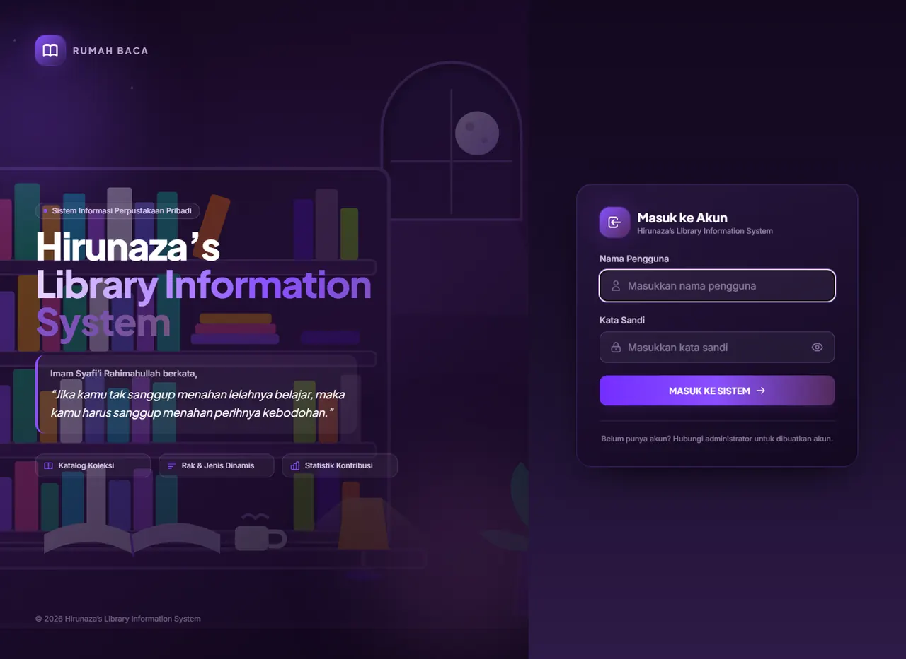

# Hirunaza's Library Information System

Aplikasi **perpustakaan rumah** multi-pengguna: catat koleksi buku keluarga, atur rak penyimpanan,
kelola genre, dan pantau kontribusi tiap anggota — semuanya dari satu dasbor.

Dibangun dengan **Django 5.2** (antarmuka) + **FastAPI** (layanan data) + **Tailwind CSS**.



---

## ✨ Fitur

| Area | Kemampuan |
| :--- | :--- |
| **Dashboard** | KPI total buku/genre/kontributor, komposisi Fiksi–Non-Fiksi, grafik Chart.js (genre & produktivitas perekam), jam digital realtime |
| **Perekaman Buku** | CRUD lengkap (CBV), **autocomplete judul** dengan pencocokan mirip (fuzzy), **deteksi duplikat** tanpa peka huruf besar/kecil & spasi ganda |
| **Katalog** | Pencarian, filter (genre, jenis, rak, status, perekam), paginasi, tampilan tabel responsif |
| **Jenis Buku** | Pilihan tetap: **Fiksi** & **Non-Fiksi** |
| **Genre / Kategori** | **Dinamis** — tambah/ubah/hapus dari halaman Pengaturan (slug otomatis, warna label) |
| **Lokasi Rak Buku** | **Dinamis** — nama, kode, warna label (tanpa isian kapasitas) |
| **Data Buku** | Tahun terbit, **tahun beli**, penerbit, halaman, rating, sinopsis, sampul (upload/URL) |
| **Pengguna** | Multi-user kolaboratif; halaman **Kelola Pengguna** untuk admin (tambah, atur ulang sandi, nonaktifkan, hapus) |
| **Identitas Aplikasi** | Judul aplikasi, nama singkat navbar, tagline, dan nama pemilik **bisa disetting** dari Pengaturan (tanpa ubah kode) |
| **Cetak Label Buku** | Label buku **2 × 3 / 3 × 4 / 4 × 5 cm** (mendatar/tegak, ukuran huruf ikut menyesuaikan) berisi **lokasi rak** + judul & penulis, siap dicetak di kertas stiker A4 |
| **Cetak Label Rak** | Label untuk **raknya sendiri**: **3 × 4 cm** atau **4 × 6 cm** (mendatar/tegak) berisi kode + nama rak, keterangan, dan jumlah buku; ada filter “rak yang belum berisi buku”, tombol **lompati N stiker** yang sudah terpakai, dan cetak semua hasil filter |
| **Modal Form** | Detail buku dibuka lewat modal “Isi Detail Buku”; **genre & rak bisa ditambah** langsung dari form buku |
| **Profil** | Foto profil, bio, statistik pribadi |
| **Tampilan** | Nuansa ungu tua, mode **gelap/terang**, responsif, animasi halus |
| **Jejak Audit** | ActivityLog mencatat tambah/ubah/hapus buku, genre, rak, dan pengguna |
| **Tentang Aplikasi** | Modal di top bar: identitas pengembang, lisensi **open source**, **tech stack**, fungsi aplikasi, tautan repo, dan syarat pemakaian (bisa dibuka langsung via `/?tentang=1`) |
| **Keamanan Sesi** | Aplikasi selalu dibuka di halaman **login**; sesi **berakhir otomatis setelah 10 menit tanpa aktivitas** (dapat diubah lewat `.env`), ada pengingat 60 detik + tombol “Tetap masuk”, dan menutup browser langsung mengakhiri sesi |
| **Panel Kendali** | `home_library.exe` — aplikasi jendela untuk pengguna awam: **Siapkan / Jalankan / Hentikan** tanpa menyentuh berkas `.bat` |

Tangkapan layar lain tersedia di [`docs/screenshots/`](docs/screenshots).

---

## 🚀 Memulai Cepat

```bat
git clone https://github.com/<USERNAME>/<REPO>.git
cd <REPO>
setup.bat          :: sekali saja: siapkan Python (bila perlu), venv, dependency, .env, migrasi
start.bat          :: jalankan Django + FastAPI, Chrome terbuka otomatis
```

**Tidak mau menyentuh `.bat`?** Klik dua kali **`home_library.exe`** — panel
kendali (tkinter) satu pintu untuk pengguna awam: **Siapkan → Jalankan → Hentikan**,
plus tombol buat akun admin dan status layanan langsung. Rincian di
[MANUAL.md bagian 5b](MANUAL.md).

> **PC baru tidak perlu punya Python lebih dulu.** `setup.bat` memakai Python yang sudah ada,
> atau mengunduh Python 3.11 sendiri lewat `uv` (dan memasang `uv` otomatis bila belum ada).
> Syarat satu-satunya saat setup: **koneksi internet**.

Panduan lengkap (termasuk pemecahan masalah & pemasangan di PC baru):
**[MANUAL.md](MANUAL.md)**

### Menjalankan manual

```bat
python -m venv .venv                 :: atau: uv venv --python 3.11 .venv
.venv\Scripts\activate
pip install -r requirements.txt
python scripts\init_env.py            :: membuat .env + SECRET_KEY acak
python manage.py migrate
python manage.py seed_data            :: data contoh (opsional)
python manage.py create_user --username admin --password Rahasia123 --superuser

:: dua terminal berbeda
python manage.py runserver 127.0.0.1:8000
python -m uvicorn api.main:app --host 127.0.0.1 --port 8001
```

| Alamat | Isi |
| :--- | :--- |
| http://127.0.0.1:8000 | Aplikasi web |
| http://127.0.0.1:8000/admin/ | Panel admin Django |
| http://127.0.0.1:8001/docs | Dokumentasi API (Swagger) |
| http://127.0.0.1:8001/api/health | Cek kesehatan service |

> Akun setelah `seed_data`: `user1` / `password123` (peran anggota).
> Untuk mengelola pengguna, naikkan dulu: `manage.py create_user --username user1 --superuser`.

---

## 🧱 Teknologi

| Lapisan | Teknologi |
| :--- | :--- |
| Framework utama | Django 5.2 (Class-Based Views, ORM, Admin) |
| Layanan API | FastAPI + Uvicorn (port terpisah, berbagi database via ORM) |
| Basis data | SQLite (default) · MySQL/MariaDB · PostgreSQL — dipilih lewat `.env` |
| Antarmuka | Django Templates + Tailwind CSS + Chart.js |
| Konfigurasi | python-dotenv (`.env`), dependency ter-pin di `requirements.txt` |
| Utilitas | Pillow (upload gambar), skrip `.bat` untuk Windows |

---

## 📁 Struktur Proyek

```
home_library_app/
├── config/                  # settings (baca .env), urls, wsgi/asgi
├── library/                 # aplikasi utama
│   ├── models.py            # Book, Genre, Shelf, UserProfile, ActivityLog
│   ├── views.py             # CBV: dashboard, CRUD buku, pengaturan, kelola pengguna, API
│   ├── forms.py             # validasi termasuk deteksi duplikat & kata sandi
│   ├── migrations/          # riwayat skema database
│   └── management/commands/ # seed_data, repair_demo_data, create_user
├── api/main.py              # service FastAPI
├── templates/               # halaman HTML (books, accounts, settings, registration)
├── static/                  # CSS Tailwind hasil build, ilustrasi SVG
├── scripts/                 # init_env.py, env_export.py, list_accounts.py
│   └── dev/                 # skrip verifikasi & render pratinjau
├── docs/screenshots/        # tangkapan layar untuk dokumentasi
├── manage.py
├── requirements.txt         # dependency Python (versi di-pin)
├── setup.bat / start.bat / stop.bat / push_github.bat
├── launcher.py / build_launcher.bat      # Panel Kendali (GUI tkinter) + skrip pembangun .exe
├── home_library.exe                      # Panel Kendali siap pakai (pengguna awam)
├── MANUAL.md                # panduan pemasangan & pemecahan masalah
└── PRD.md                   # kebutuhan produk & catatan revisi
```

---

## ✅ Pengujian

Skrip verifikasi mandiri (semuanya tanpa perlu server berjalan, kecuali yang diberi catatan):

```bat
.venv\Scripts\python.exe scripts\dev\verify_features_v2.py      :: 72 pemeriksaan fitur & halaman
.venv\Scripts\python.exe scripts\dev\verify_user_management.py  :: 30 pemeriksaan kelola pengguna
.venv\Scripts\python.exe scripts\dev\verify_start_stop_cycle.py :: 9 pemeriksaan start.bat/stop.bat (Windows)
.venv\Scripts\python.exe scripts\dev\verify_perbaikan_v6.py   :: 58 pemeriksaan Tentang Aplikasi, Panel Kendali, kesiapan tanpa Node
.venv\Scripts\python.exe scripts\dev\cek_css_lokal.py         :: audit cakupan CSS lokal (harus 0 kelas hilang)
.venv\Scripts\python.exe scripts\dev\verify_fresh_clone.py      :: uji skenario "clone di PC baru"
.venv\Scripts\python.exe scripts\dev\render_preview.py          :: render halaman ke preview/
```

CI otomatis (checks + kedua suite utama) berjalan lewat GitHub Actions:
[`.github/workflows/ci.yml`](.github/workflows/ci.yml)

---

## 🔐 Keamanan & Konfigurasi

- `SECRET_KEY`, `DEBUG`, `ALLOWED_HOSTS`, dan kredensial database **tidak** ditulis di kode —
  semuanya dibaca dari `.env` (lihat [`.env.example`](.env.example)).
- File `.env`, database lokal, folder `media/`, `.venv/`, dan `node_modules/` diabaikan Git.
- Kata sandi disimpan ter-hash dengan validator Django; aksi sensitif tercatat di ActivityLog.

---

## 📄 Lisensi

Proyek pribadi — belum dilisensikan untuk distribusi publik. Hubungi pemilik repositori
bila ingin menggunakannya.

---

*Versi 1.3.0 — Django 5.2 · Python 3.11 · dibuat untuk koleksi buku keluarga.*
